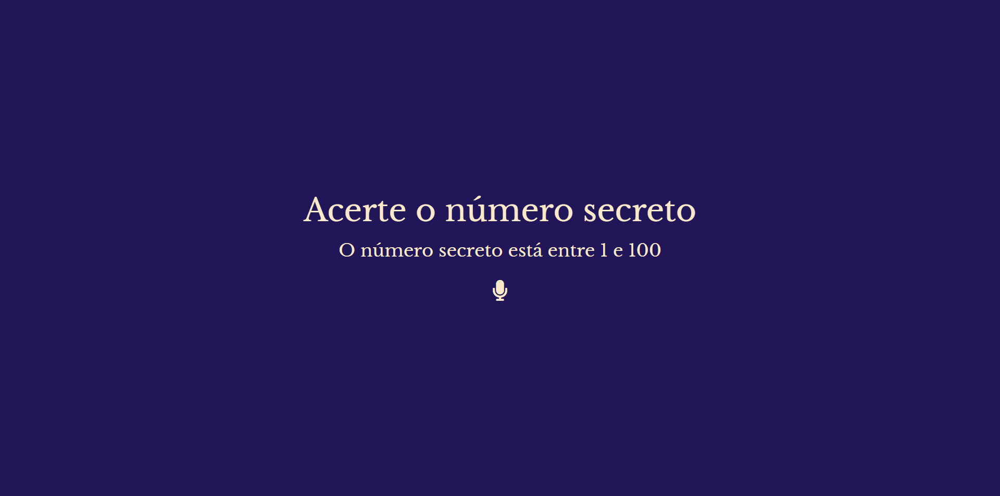

  

O jogo do número secreto com reconhecimento de voz, foi desenvolvido para que os usuário não precisem digitar.

## Tecnologias utilizadas durante o curso
* JavaScript
* HTML
* CSS
* API voice recognition JS

## O que foi ensinado no curso 

* Descubra como aplicar validações em seus projeto com JavaScript
* Crie um projeto com HTML, CSS e JavaScript do zero
* Aprenda a utilizar funções build-in do JavaScript
* Aplique reconhecimento de voz com JavaScript
* Manipule dados, eventos e elementos com JavaScript

## Melhoria apresentada e executada
* Realizei a inclusão do elemento microfone com animação, com objetivo de dar um feedback para o usuário

 

